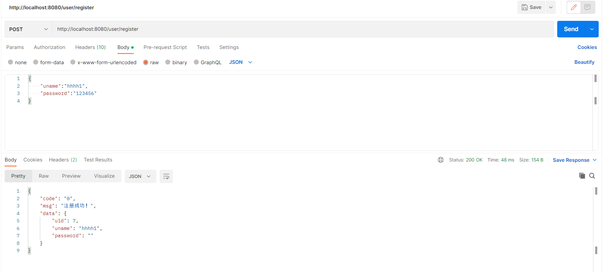
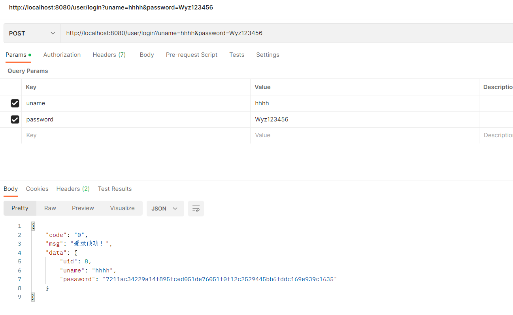
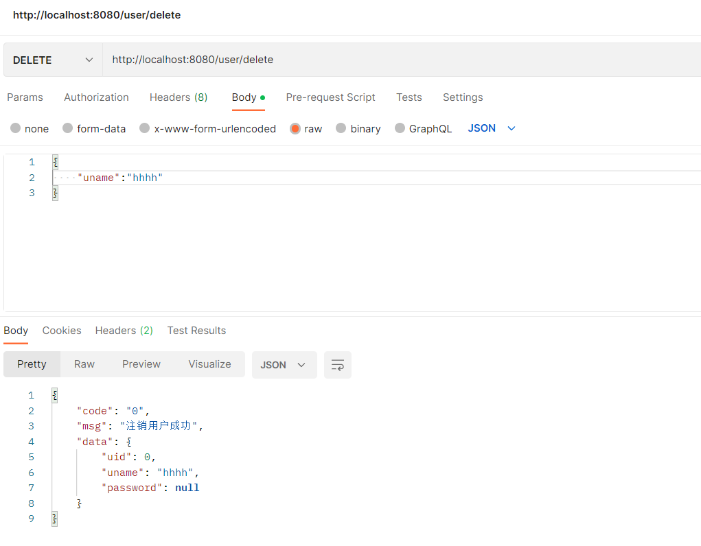
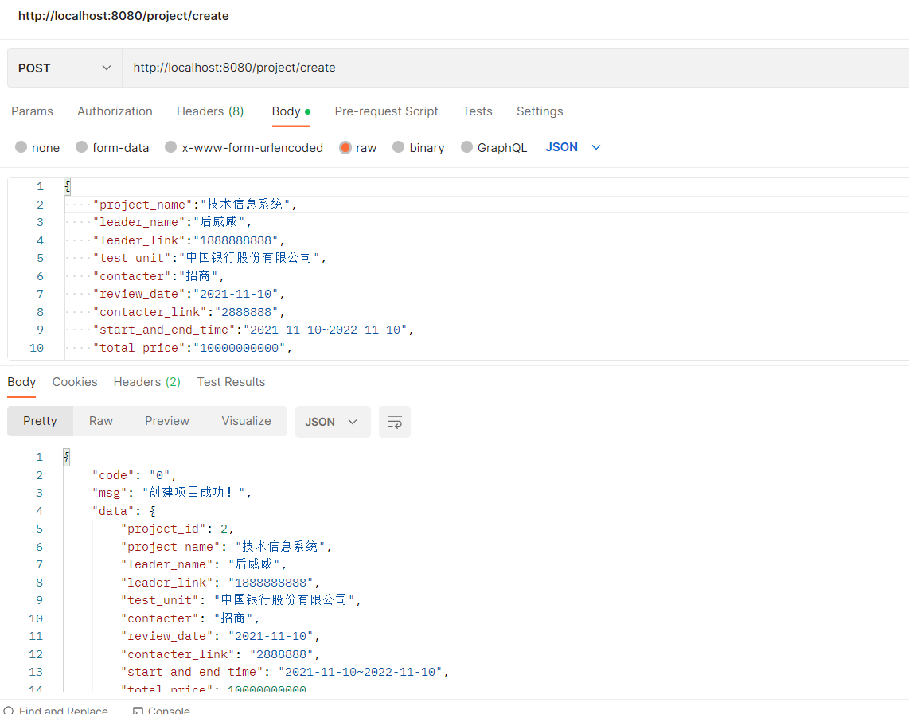
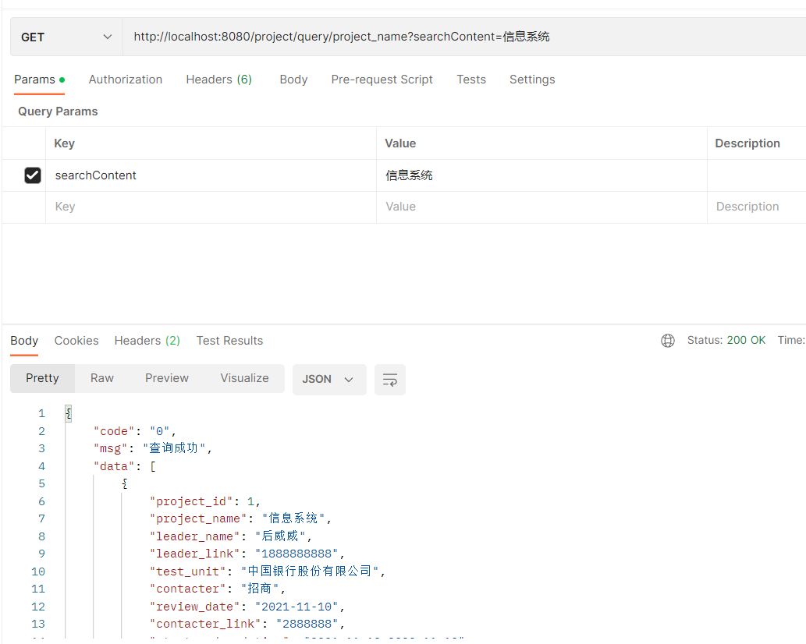
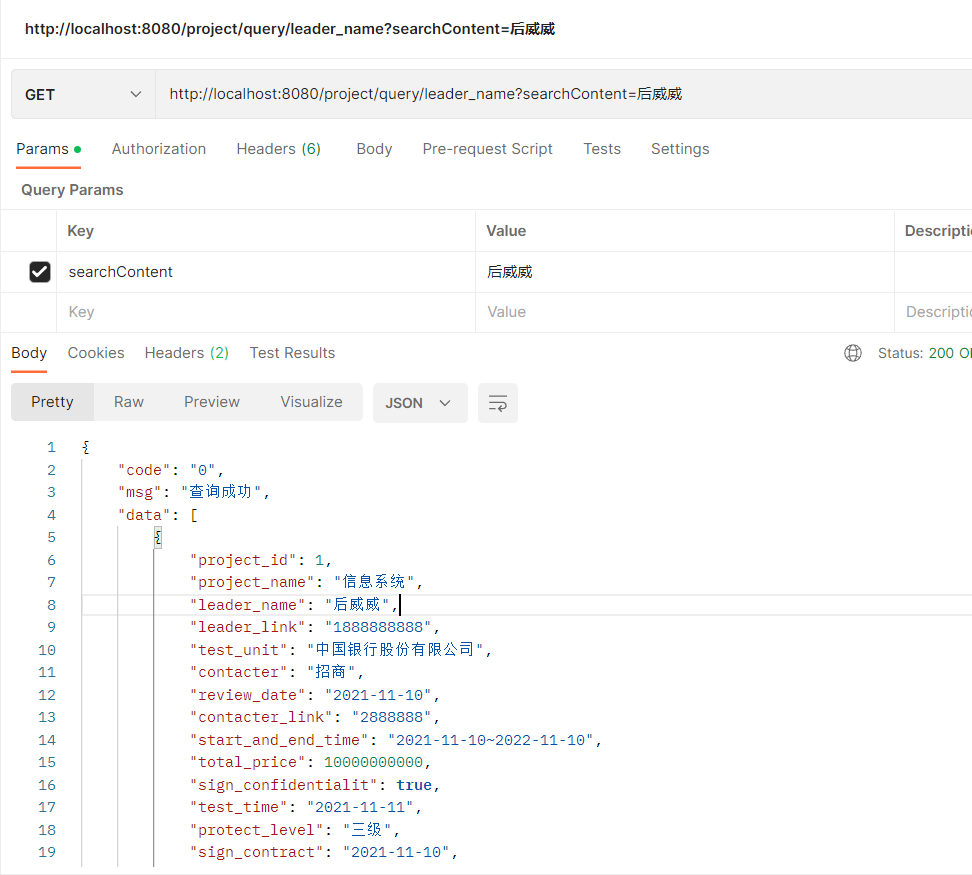
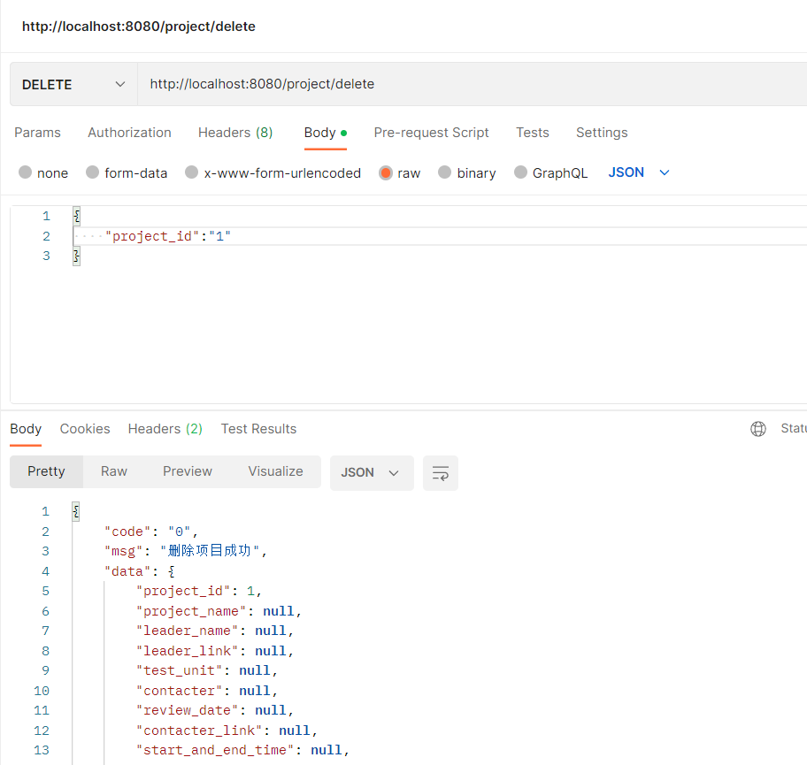
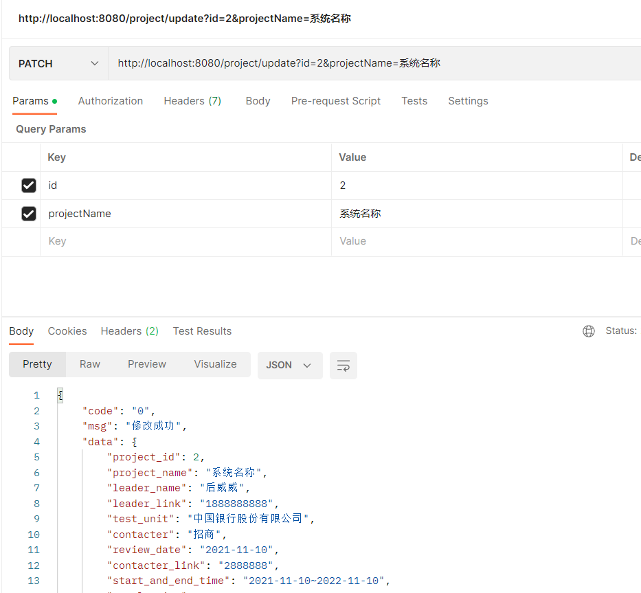
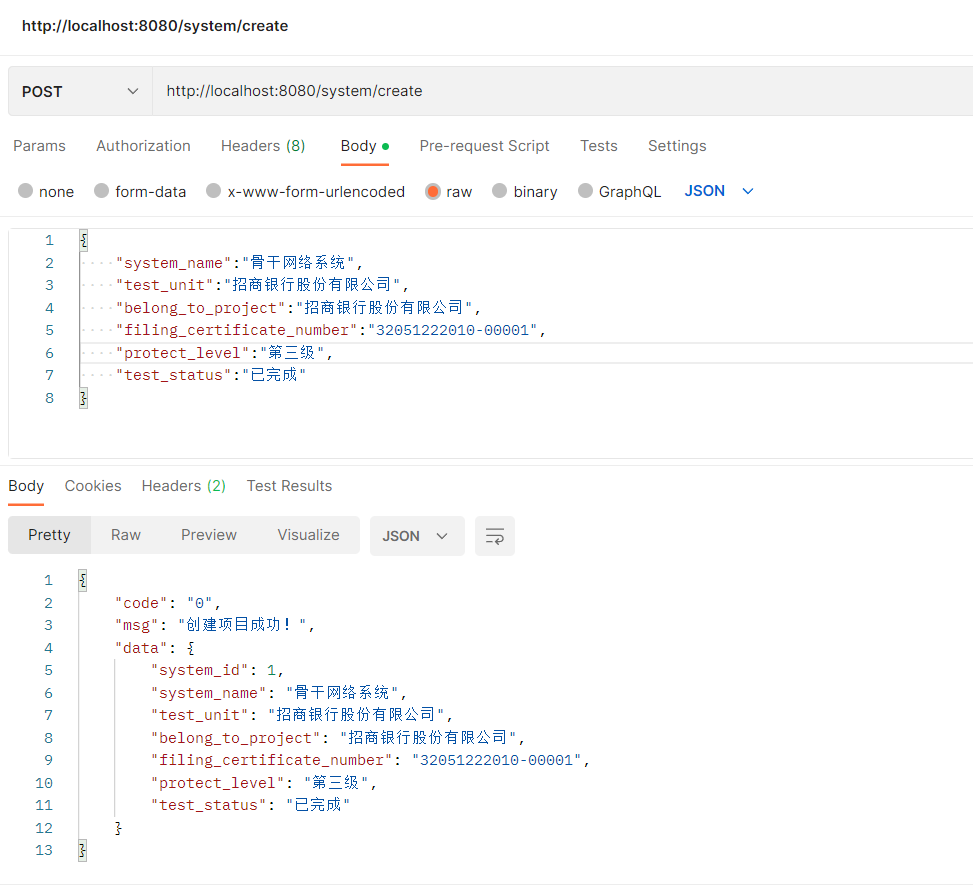

## 数据结构

### 用户

| 变量             |        |
| ---------------- | ------ |
| uid(long)        | 用户id |
| uname(string)    | 用户名 |
| password(string) | 密码   |

### 项目

| 变量                        |                      |
| --------------------------- | -------------------- |
| project_id(long)            | 项目ID               |
| project_name(string)        | 项目名称             |
| leader_name(string)         | 项目负责人           |
| leader_link(string)         | 项目负责人的联系方式 |
| test_unit(string)           | 被测单位             |
| contacter(string)           | 联系人               |
| review_date(string)         | 省等保办项目审核日期 |
| contacter_link(string)      | 联系人的联系方式     |
| start_and_end_time(string)  | 计划测评工期起止日期 |
| total_price(long)           | 合同总价             |
| sign_confidentialit(boolen) | 是否签订保密协议     |
| test_time(date)             | 测评时间             |
| protect_level(string)       | 保护等级             |
| sign_contract(date)         | 合同时间             |
| review(boolen)              | 审核是否通过         |

### 系统

| 变量                              |              |
| --------------------------------- | ------------ |
| system_id(long)                   | 系统id       |
| system_name(string)               | 系统名称     |
| test_unit(string)                 | 被测单位     |
| belong_to_project(string)         | 所属项目     |
| filing_certificate_number(string) | 备案证明编号 |
| protect_level(string)             | 保护等级     |
| test_status(string)               | 测评状态     |

### 测评师

## 共用接口

### 1.用户管理

请求注册

POST /user/register

请求登录‘

POST /user/login

注销

DELETE /user/delete

### 2.项目管理

#### 新建项目

POST /project/create

{

  "project_name":"综合业务信息系统",

  "leader_name":"侯伟",

  "leader_link":"1888888888",

  "test_unit":"招商银行股份有限公司",

  "contacter":"招商",

  "review_date":"2021-11-10",

  "contacter_link":"2888888",

  "start_and_end_time":"2021-11-10~2022-11-10",

  "total_price":"10000000000",

  "sign_confidentialit":"true",

  "test_time":"2021-11-10",

  "protect_level":"二级",

  "sign_contract":"2021-11-10",

  "review":"true"

}

#### 获取项目信息（key都为searchContent）

根据项目名称 获取项目信息

GET /project/query/project_name

根据项目负责人 获取项目信息

GET /project/query/leader_name

根据被测单位 获取项目信息

GET /project/query/test_unit

根据测评时间 获取项目信息

GET /project/query/test_time

根据合同签署时间 获取项目信息

GET /project/query/sign_contract

#### 删除项目信息

DELETE /project/delete

#### 修改项目属性

根据id修改项目属性

PATCH /project/update

### 3.系统管理

#### 新增系统

POST /system/create

{

  "system_name":"骨干网络系统",

  "test_unit":"招商银行股份有限公司",

  "belong_to_project":"招商银行股份有限公司",

  "filing_certificate_number":"32051222010-00001",

  "protect_level":"第三级",

  "test_status":"已完成"

}

### 4.测评师管理

